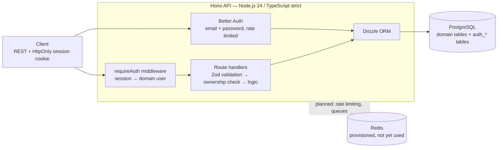

# Personal Financial Tracker API

[Українська версія](README.uk.md)

A REST API for tracking personal income and expenses: accounts, categories,
transactions and budgets, scoped per authenticated user.

Built as a deliberate backend learning project by a frontend developer moving
to backend engineering. Every architectural decision is written down with its
reasoning and its rejected alternatives in [`docs/DECISIONS.md`](docs/DECISIONS.md)
— that record, not the feature count, is the point of the repository.

---

## Status

**Working today**

- Registration and login via Better Auth (email + password), server-side
  sessions delivered as an HttpOnly cookie
- Shared auth middleware resolving a session to the domain user
- Accounts CRUD — 5 endpoints, fully scoped to the owner
- Integration tests against a real, isolated test database (Vitest)
- Local infrastructure via Docker Compose (PostgreSQL + Redis)

**Next**

Schema hardening (currency model, amount-sign invariants, calendar dates,
soft delete), then categories, transactions and budgets, then the aggregation
endpoints — balances, spending by category, cashflow, budget progress.
Live backlog: [GitHub Issues](../../issues) grouped into milestones.

Not yet: CI, deployment, OpenAPI docs.

---

## Architecture



---

## Stack

| Layer | Choice | Why |
|---|---|---|
| Runtime | Node.js 24 | LTS, native APIs replace dependencies |
| Language | TypeScript 5, strict | No `any`, explicit return types on exports |
| Framework | Hono | Minimal — every decision stays visible instead of hidden in framework magic |
| ORM | Drizzle | Type-safe and SQL-shaped; forces thinking in SQL rather than around it |
| Database | PostgreSQL | Industry standard |
| Validation | Zod | Every input, every time |
| Auth | Better Auth | Modern, type-safe; server-side sessions |
| Testing | Vitest | Integration tests over unit tests for route handlers |
| Local infra | Docker Compose | From day one, not as a later complication |

---

## Data model

Five domain tables — `users`, `accounts`, `categories`, `transactions`,
`budgets` — plus four `auth_*` tables owned by Better Auth and kept
deliberately separate from the domain schema.

Schema lives in [`src/db/schema.ts`](src/db/schema.ts); migrations in
`src/db/migrations/`.

Notable properties:

- **UUID primary keys everywhere.** `serial` leaks row counts and cannot be
  generated before insert.
- **`numeric(12,2)` for every money field**, serialized as a JSON string.
  `float` rounding error is unacceptable in financial data.
- **Account balance is never stored** — it is computed from transactions.
- **Every foreign key is indexed.** Skipped indexes are commented as such.
- **Deleting a category never deletes transaction history** — it leaves
  `category_id = null`. Budgets, which are meaningless without a category,
  cascade instead.

---

## Architectural decisions

The full record with reasoning, trade-offs and rejected alternatives is in
[`docs/DECISIONS.md`](docs/DECISIONS.md). A few worth reading first:

| Decision | Short reason |
|---|---|
| Sessions in an HttpOnly cookie, not a JWT in `localStorage` | JavaScript cannot read the cookie even during an XSS |
| Better Auth tables kept separate from the domain `users` table | Avoids `accounts` (financial) colliding with `auth_account` (OAuth), and separates authentication from domain data |
| Registration and login go straight to Better Auth's own endpoints | A custom wrapper would be another layer to maintain with no gain |
| Another user's resource returns `404`, never `403` | `403` confirms the resource exists — `404` leaks nothing |
| Balance computed, never stored | Two concurrent writes cannot overwrite each other's result if there is no field to overwrite |
| Session hook is *not* atomic with user creation | Verified against Better Auth's source: `after` hooks run post-commit by design. The risk is accepted explicitly rather than hidden |
| Integration tests run against a separate real database | Mocked persistence proves the mock works, not the query |

Decided and pending implementation: ISO-4217 currency per account with
aggregates never mixing currencies, positive-only amounts with direction from
`type`, calendar dates for transactions, soft-deleted accounts, transfers as
two linked rows. See the *Schema Hardening* milestone.

Cross-cutting API rules every endpoint obeys — status codes, error shape,
ownership checks, money and date formats, pagination — are in
[`docs/API-CONVENTIONS.md`](docs/API-CONVENTIONS.md).

---

## API surface

```
POST   /api/auth/sign-up/email     register (no auto sign-in, by design)
POST   /api/auth/sign-in/email     log in → Set-Cookie: session token
GET    /api/auth/get-session       current session

POST   /accounts                   create
GET    /accounts                   list own accounts
GET    /accounts/:id               read one
PATCH  /accounts/:id               update
DELETE /accounts/:id               delete
```

All `/accounts` routes require a session. A runnable request collection lives
in [`api.http`](api.http) and is kept current as endpoints land.

---

## Running locally

```bash
docker compose up -d
cp .env.example .env
npm install
npm run db:migrate
npm run dev
```

Full walkthrough, database inspection and troubleshooting:
[`docs/ONBOARDING.md`](docs/ONBOARDING.md).

```bash
npm run lint && npm run typecheck && npm test
```

---

## Documentation

| File | What it holds |
|---|---|
| [`AGENTS.md`](AGENTS.md) | Single source of truth for AI coding agents; imported by Claude Code, Cursor and Antigravity |
| [`docs/API-CONVENTIONS.md`](docs/API-CONVENTIONS.md) | Binding cross-cutting API contract |
| [`docs/DECISIONS.md`](docs/DECISIONS.md) | Append-only architectural decision log |
| [`docs/LEARNING.md`](docs/LEARNING.md) | Backend concepts as they first appear in the codebase |
| [`docs/ONBOARDING.md`](docs/ONBOARDING.md) | Local setup from a clean checkout |
| [`docs/PROGRESS.md`](docs/PROGRESS.md) | Checkpoint status |
| [`docs/ROADMAP.md`](docs/ROADMAP.md) | The wider frontend → backend transition plan |
| [`CONTRIBUTING.md`](CONTRIBUTING.md) | Git flow, PR rules, agent setup |

Every pull request goes through CodeRabbit review; comments are either fixed or
answered, never dismissed silently.
