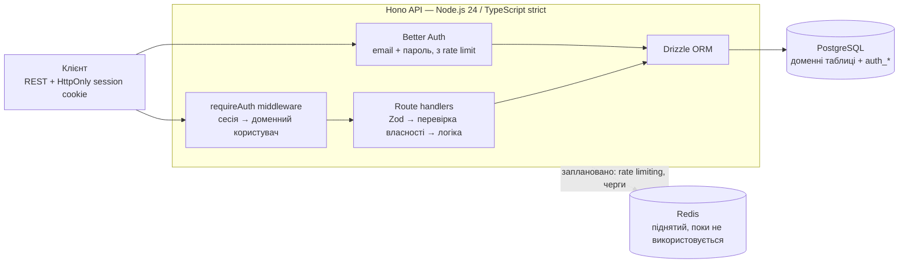

# Personal Financial Tracker API

[English version](README.md)

REST API для обліку особистих доходів і витрат: рахунки, категорії,
транзакції та бюджети, кожен запис прив'язаний до автентифікованого
користувача.

Проєкт свідомо навчальний — перехід frontend-розробника в backend. Кожне
архітектурне рішення записане разом із причиною і відкинутими альтернативами
в [`docs/DECISIONS.md`](docs/DECISIONS.md). Саме цей запис, а не кількість
фіч, — сенс репозиторію.

---

## Стан

**Працює зараз**

- Реєстрація і логін через Better Auth (email + пароль), серверні сесії через
  HttpOnly cookie
- Спільний auth middleware, що резолвить сесію в доменного користувача
- CRUD рахунків — 5 ендпоінтів, повністю обмежені власником
- Інтеграційні тести проти реальної ізольованої тестової бази (Vitest)
- Локальна інфраструктура через Docker Compose (PostgreSQL + Redis)

**Далі**

Зміцнення схеми (модель валют, інваріанти знака суми, календарні дати, soft
delete), потім категорії, транзакції й бюджети, потім агрегаційні
ендпоінти — баланси, витрати за категоріями, cashflow, виконання бюджету.
Живий беклог: [GitHub Issues](../../issues), згруповані в milestones.

Ще немає: CI, деплою, OpenAPI-документації.

---

## Архітектура



---

## Стек

| Шар | Вибір | Чому |
|---|---|---|
| Runtime | Node.js 24 | LTS, нативні API замінюють залежності |
| Мова | TypeScript 5, strict | Без `any`, явні типи повернення на експортах |
| Фреймворк | Hono | Мінімалізм — кожне рішення видно, а не сховане у магії фреймворка |
| ORM | Drizzle | Type-safe і SQL-подібний; змушує думати в SQL, а не в обхід нього |
| База даних | PostgreSQL | Промисловий стандарт |
| Валідація | Zod | Кожен вхід, кожного разу |
| Автентифікація | Better Auth | Сучасна, type-safe; серверні сесії |
| Тестування | Vitest | Інтеграційні тести замість юніт-тестів для хендлерів |
| Локальна інфра | Docker Compose | З першого дня, не як пізніше ускладнення |

---

## Модель даних

П'ять доменних таблиць — `users`, `accounts`, `categories`, `transactions`,
`budgets` — плюс чотири таблиці `auth_*`, якими керує Better Auth і які
свідомо тримаються окремо від доменної схеми.

Схема — [`src/db/schema.ts`](src/db/schema.ts), міграції — `src/db/migrations/`.

Що варто відзначити:

- **UUID як primary key скрізь.** `serial` розкриває кількість записів і його
  не можна згенерувати до вставки.
- **`numeric(12,2)` для всіх грошових полів**, у JSON — рядком. Похибка
  округлення `float` неприпустима у фінансових даних.
- **Баланс рахунку ніколи не зберігається** — рахується з транзакцій.
- **Кожен foreign key проіндексований.** Свідомо пропущені індекси
  прокоментовані.
- **Видалення категорії не видаляє історію транзакцій** — залишає
  `category_id = null`. Бюджети, які без категорії втрачають сенс, натомість
  видаляються каскадно.

---

## Архітектурні рішення

Повний запис із причинами, компромісами і відкинутими альтернативами —
[`docs/DECISIONS.md`](docs/DECISIONS.md). Кілька, з яких варто почати:

| Рішення | Коротка причина |
|---|---|
| Сесія в HttpOnly cookie, а не JWT у `localStorage` | JavaScript не прочитає cookie навіть під час XSS |
| Таблиці Better Auth окремо від доменної `users` | Уникає конфлікту `accounts` (фінансові) з `auth_account` (OAuth) і розділяє автентифікацію та доменні дані |
| Реєстрація й логін ідуть напряму у власні ендпоінти Better Auth | Кастомна обгортка — це ще один шар для підтримки без реальної користі |
| Чужий ресурс повертає `404`, ніколи `403` | `403` підтверджує, що ресурс існує — `404` не видає нічого |
| Баланс рахується, а не зберігається | Два паралельні записи не можуть перезаписати результат один одного, якщо немає поля, яке можна перезаписати |
| Hook створення профілю **не** атомарний зі створенням користувача | Перевірено по вихідниках Better Auth: `after`-хуки виконуються після коміту за задумом. Ризик прийнятий явно, а не схований |
| Інтеграційні тести йдуть проти окремої реальної бази | Замокана персистентність доводить, що працює мок, а не запит |

Прийнято, але ще не реалізовано: валюта ISO-4217 на рахунку з агрегатами, які
ніколи не змішують валюти; тільки додатні суми з напрямом із `type`;
календарні дати транзакцій; soft delete рахунків; перекази як два зв'язані
рядки. Дивись milestone *Schema Hardening*.

Наскрізні правила API, яких дотримується кожен ендпоінт — коди статусів, форма
помилки, перевірка власності, формати грошей і дат, пагінація — в
[`docs/API-CONVENTIONS.md`](docs/API-CONVENTIONS.md).

---

## Поверхня API

```
POST   /api/auth/sign-up/email     реєстрація (без автологіну, свідомо)
POST   /api/auth/sign-in/email     логін → Set-Cookie із токеном сесії
GET    /api/auth/get-session       поточна сесія

POST   /accounts                   створити
GET    /accounts                   список власних рахунків
GET    /accounts/:id               прочитати один
PATCH  /accounts/:id               оновити
DELETE /accounts/:id               видалити
```

Усі маршрути `/accounts` потребують сесії. Готова до запуску колекція
запитів — [`api.http`](api.http), оновлюється разом із появою ендпоінтів.

---

## Запуск локально

```bash
docker compose up -d
cp .env.example .env
npm install
npm run db:migrate
npm run dev
```

Повний покроковий опис, перегляд бази і troubleshooting —
[`docs/ONBOARDING.md`](docs/ONBOARDING.md).

```bash
npm run lint && npm run typecheck && npm test
```

---

## Документація

| Файл | Що містить |
|---|---|
| [`AGENTS.md`](AGENTS.md) | Єдине джерело правди для AI-агентів; імпортується Claude Code, Cursor і Antigravity |
| [`docs/API-CONVENTIONS.md`](docs/API-CONVENTIONS.md) | Обов'язковий наскрізний контракт API |
| [`docs/DECISIONS.md`](docs/DECISIONS.md) | Append-only журнал архітектурних рішень |
| [`docs/LEARNING.md`](docs/LEARNING.md) | Бекенд-концепції в міру їх першої появи в коді |
| [`docs/ONBOARDING.md`](docs/ONBOARDING.md) | Локальний запуск із чистого checkout |
| [`docs/PROGRESS.md`](docs/PROGRESS.md) | Статус чекпоінтів |
| [`docs/ROADMAP.md`](docs/ROADMAP.md) | Ширший план переходу frontend → backend |
| [`CONTRIBUTING.md`](CONTRIBUTING.md) | Git flow, правила PR, налаштування агентів |

Кожен pull request проходить рев'ю CodeRabbit; коментарі або виправляються,
або отримують відповідь — ніколи не закриваються мовчки.
